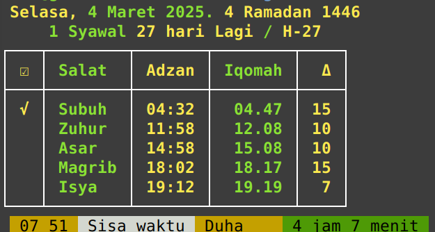
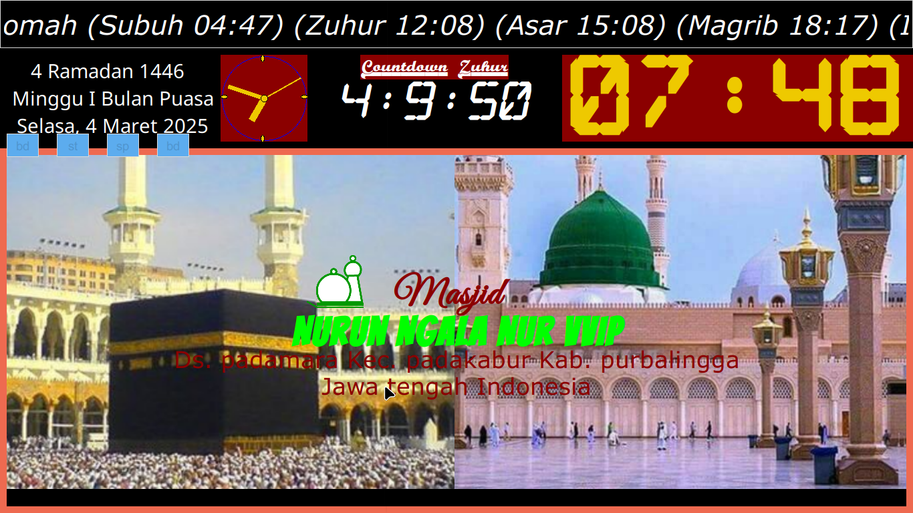

# 🌟 BelBedu9: Introduction and Features 🌟

## A. Introduction

Welcome to the world of **BelBedu9**, an innovative message notification 
application designed to transform and elevate your prayer experience! 🙏✨ This 
state-of-the-art application harnesses the power of your computer monitor or 
TV, paired with engaging audio notifications, to deliver timely alerts before 
the adhan, during the adhan, and for the iqamah. With exceptional accuracy, 
BelBedu9 calculates the five daily obligatory prayer times based on your 
precise GPS location in Indonesia. 🕌

BelBedu9 is perfect for a wide range of environments, including homes, mosques, 
offices, hospitals, markets, restaurants, and cafes. It not only announces the 
current prayer time but also prominently displays it on the screen, ensuring 
that everyone is kept in the loop. Plus, the application can be configured to 
send hourly notifications, providing real-time updates on the current prayer 
time, complete with the hour and minute. ⏰

But that’s not all! BelBedu9 also boasts an intelligent power management system 
for your monitor or TV, allowing you to effortlessly turn the display on and 
off to save energy. 🌱 With its intuitive user interface and customizable 
settings, BelBedu9 is the ultimate solution for anyone looking to stay 
connected to their prayer schedule while promoting energy efficiency. 
Experience the convenience and innovation of prayer time notifications like 
never before with BelBedu9! 🚀

## How to Configure

Configuring BelBedu9 is a breeze! 🛠️ You can easily make adjustments using a 
text editor like Geany on Linux or any text editor available on Android. 
Additionally, you can remotely configure BelBedu9 over a Wi-Fi connection by 
utilizing an SSH client on Windows, Linux, or Android platforms. This 
flexibility allows for convenient adjustments and management from virtually 
anywhere, ensuring that you can tailor the device to meet your specific needs 
with ease. 🌐

## How to Close the GUI Screen of BelBedu9

Closing the BelBedu9 GUI is incredibly simple! Just perform a right mouse click 
or use the command **CLI bd tt** or **gt tt** to close it effortlessly. 🖱️

With BelBedu9, staying connected to your prayer schedule has never been easier 
or more efficient! Embrace the future of prayer notifications and enhance your 
spiritual journey today! 🌈

## Additional Features of BelBedu9

BelBedu9 is packed with features that enhance its functionality and user 
experience. Here are some standout capabilities that make this application a 
must-have for anyone looking to streamline their prayer notifications:

### Customizable Notifications
- **Personalized Alerts**: Users can customize the type and frequency of 
notifications, ensuring that they receive alerts that suit their preferences. 
Whether you prefer gentle reminders or more pronounced alerts, BelBedu9 has you 
covered. 🔔
- **Multi-Language Support**: The application supports multiple languages, 
making it accessible to a diverse user base. This feature ensures that everyone 
can navigate and utilize the app comfortably. 🌍

### Visual and Audio Integration
- **Dynamic Display Options**: The application allows for various display 
settings, including different fonts, colors, and sizes for the prayer times and 
notifications. This ensures that the information is not only clear but also 
visually appealing. 🎨
- **Audio Notifications**: In addition to visual alerts, BelBedu9 provides 
audio notifications that can be customized. Choose from a selection of sounds 
to accompany your prayer time alerts, enhancing the overall experience. 🎶

### Energy Efficiency
- **Smart Power Management**: The automatic power management feature not only 
helps conserve energy but also extends the lifespan of your monitor or TV. This 
eco-friendly approach aligns with the values of sustainability while ensuring 
that you remain connected to your prayer schedule. 🌿

### User-Friendly Interface
- **Intuitive Design**: The interface is designed with user experience in mind, 
making it easy for anyone to navigate and configure settings without technical 
expertise. The straightforward layout ensures that users can quickly access the 
features they need. 🖥️
- **Help and Support**: BelBedu9 comes with comprehensive documentation and 
support resources, ensuring that users can find assistance whenever needed. 
Whether you have a question about configuration or troubleshooting, help is 
just a click away. 📚

## Conclusion

BelBedu9 is more than just a notification application; it’s a comprehensive 
tool designed to enhance your spiritual practice. With its innovative features, 
customizable settings, and user-friendly interface, it provides a seamless way 
to stay connected to your prayer schedule. Experience the convenience and 
efficiency of BelBedu9 today, and transform the way you engage with your daily 
prayers! 🌟

For more information or to get started with BelBedu9, feel free to reach out 
via email at [duitmoro@yahoo.com](mailto:duitmoro@yahoo.com). Your journey 
towards a more connected prayer experience begins here! 🚀

---

## B. Author of BelBedu9  
**Endro Mei Asmoro**  
Email: [duitmoro@yahoo.com](mailto:duitmoro@yahoo.com)  

---

## C. GUI Features

The configuration files can be found in the **config/vvip** or **config/vip** 
directories. Here’s a breakdown of the exciting features available in the GUI:

### Animation
1. **Bouncing Circle**: You can easily enable or disable the bouncing circle 
animation. 🔄
2. **Dynamic Mosque Information**: The names and addresses of mosques can 
flip-flop for a lively display. 🕌

### Running Text
1. **Positioning**: The running text can be configured to appear either above 
or below the main display. 📜
2. **Content Customization**: Fill it with current mosque balance information, 
details about the khatib and imam for Friday prayers, announcements for 
recitations, and more. 🗣️
3. **Calendar Display**: Options to show both the Gregorian and Islamic 
calendars are available. 📅
4. **Flexible Sentences**: You can configure up to six sentences, limited only 
by your computer's display capabilities. ✍️
5. **Special Celebrations**: Besides Fridays, you can also display birthdays 
and congratulatory messages for specific dates. 🎉
6. **Text Customization**: Adjust the size, color, and font type of the running 
text to suit your preferences. 🎨
7. **Date Information**: The display includes both the Gregorian and Hijri 
dates, along with the remaining days until the next Hijri month. 📆
8. **Friday Specials**: Every Friday, there’s a unique setting for running 
text. 🕋
9. **Jumuah Officers**: Display the names of the Jumuah officers, including the 
imam, khatib, and muadzin. 👥

### Calendar
1. **Customizable Appearance**: You can configure the size, color, and font 
type of the calendar. 🎨
2. **Calendar Options**: Switch between the Gregorian and Hijri calendars as 
needed. 📅
3. **Dual Calendar Display**: Choose to display both the Gregorian and Hijri 
calendars simultaneously. 🌙
4. **Manual Adjustments**: If there’s a discrepancy of a day (like during 
Ramadan), you can manually correct it in the **configuration.conf** file (CLI 
BelBedu9) and **kalenderJamhitungmundurDll.conf** (GUI BelBedu9). 🔧
5. **Ramadan Weeks**: The calendar displays the 1st, 2nd, and 3rd weeks of 
Ramadan. 🌙
6. **Muharram Dates**: View the dates from the 1st to the 10th of Muharram. 📅
7. **Shawwal Dates**: See the dates from the 1st to the 10th of Shawwal. 📆
8. **Tasyrik Days**: Displays the dates for the 11th, 12th, and 13th of 
Tasyrik. 📅

### Countdown
1. **Configurable Format**: Set the countdown with your choice of point 
separators, colons, and more for the next prayer, along with customizable font 
size, color, and type. ⏳
2. **Prayer Timing**: Start the countdown from the time remaining before the 
adhan (7 minutes or less). ⏰
3. **Iqomah Countdown**: Track the time from the adhan to iqomah. ⏳

### Digital Clock
1. **Separator Options**: Configure the digital clock with a dot separator 
(following PUEBI/Indonesian spelling guidelines) or a colon. ⏲️
2. **Customizable Display**: Adjust the size, color, and font type of the 
digital clock to your liking. 🎨

### Analog Clock
1. **Visibility Options**: Choose whether to hide or show the hour, minute, and 
second hands. ⏱️
2. **Size Configuration**: Adjust the width and height of the analog clock to 
fit your display needs. 📏

With these features, the GUI of BelBedu9 offers a versatile and user-friendly 
experience, making it easier than ever to stay connected with prayer times and 
important dates! 🌟

### Pictures of the Mosque/Kaaba

1. **Dynamic Display**: Enjoy the flexibility to change the appearance time of 
mosque or Kaaba images, ranging from seconds to minutes, for a refreshing 
visual experience. 🖼️
2. **Custom Image Location**: Easily change the location of your image files to 
suit your preferences. 📂
3. **Manual Image Change**: Switch the mosque image manually by simply pressing 
the **bd** label, giving you control over what’s displayed. 🖱️
4. **Start/Stop Functionality**: You can effortlessly start or stop the display 
of mosque images, allowing for a tailored viewing experience. ⏸️
5. **Address Customization**: Change the address of the mosque to reflect your 
specific location or preference. 📍

### List of Prayer Schedules

1. **Flexible Positioning**: Configure the prayer schedule list to appear at 
the top or bottom of the display, based on your layout preference. 📋
2. **Customizable Appearance**: Adjust the font size, type, color, and style to 
create a visually appealing prayer schedule that suits your taste. 🎨
3. **Highlight Current Prayer**: Differentiate the font color of the current 
prayer time from other prayer times for easy identification. 🔍
4. **Minimalist Option**: Disable the prayer list on the template to showcase 
only the stunning images of the mosque and Kaaba, creating a serene atmosphere. 
🌌
5. **Dynamic Friday Labels**: On Fridays, the Dhuhr label automatically changes 
to the Jumuah label after 12:45, reverting back to Dhuhr afterward. 🔄
6. **Configurable Time Formats**: Set the prayer times according to PUEBI 
standards (using dots) or non-PUEBI standards (using colons) for your 
convenience. ⏰
7. **Time System Options**: Choose between a 24-hour or 12-hour system for 
displaying prayer times, catering to your preference. 🕒

### Analog Clock

1. **Custom Display Options**: Configure the analog clock to show only the 
hour, minute, second, or any combination of these elements for a personalized 
touch. ⏱️
2. **Size Adjustability**: Easily adjust the size of the analog clock to fit 
your display needs. 📏

### D. CLI (Command Line Interface) Features

1. **Online Updates**: Update your prayer schedule online daily using the 
Aladhan website and other sources with the command **bd online**. 🌐
2. **Offline Updates**: Keep your data current offline until the expiration 
time with the command **bd offline**. 📅
3. **Manual Updates**: Manually update your data until it expires using the 
command **bd manual**. 🔄
4. **Prayer Time Adjustments**: Correct the prayer list manually by adding or 
subtracting minutes with the command **bd th**. ⏳
5. **Display Prayer Schedule**: Easily display the prayer schedule using the 
command **bd**. 📋
6. **Message Box Alerts**: Show a message box on the monitor before the adhan 
and iqomah with commands **pb 1** and **pb q**. 📢
7. **Audio Notifications**: Play audio for the current prayer time and the 
current hour using commands **pb 4** or **pb 12**. 🎶
8. **Manual Corrections**: Make manual corrections to prayer names and other 
details as needed. ✏️

### Template

1. **Template Customization**: Change templates using CLI commands, such as 
**pb 5** and **pb 6** for VVIP, and **pb 7** and **pb 8** for VIP users. 🎨
2. **Diverse Template Options**: Choose from six VVIP templates, including 
**melihatjauh**, **satudaftarshalat**, **daftarshalatlengkap**, **gambarpenuh**
, **satutower**, and **duatower**, plus two bonus templates: **jamemas** and 
**jamputih**. 🖼️
3. **Template Rotation**: Automatically switch to the **jamemas** or 
**jamputih** template every 7 minutes before the adhan time for a dynamic 
display. 🔄
4. **Automatic Template Change**: Experience seamless transitions as the 
template automatically changes at the beginning of each prayer. ⏰

### GT Features

Discover the power of customization with BelBedu9! Below is a list of commands 
that allow you to tailor the template to suit your unique needs. Let’s dive 
into the exciting possibilities! 🚀

With these features, BelBedu9 provides a comprehensive and engaging experience, 
ensuring that your prayer notifications and displays are not only informative 
but also visually captivating! 🌈

- **gt mj**: Switch to a far-sighted template for a broader view of your 
surroundings. 🌄
- **gt sds**: Access a prayer list template for quick and easy reference to 
your prayer schedules. 📋
- **gt dsl**: Opt for a complete prayer list template that offers in-depth 
information about all your prayer times. 📅
- **gt gp**: Enjoy full images with this template, providing a clearer and more 
detailed visual display. 🖼️
- **gt st**: Focus on a single tower with the onetower template for a 
streamlined view. 🏢
- **gt dt**: Display two towers simultaneously with the two towers template for 
a dynamic perspective. 🏙️
- **gt je**: Use the jamemas template to showcase the exact time with 
precision. ⏰
- **gt jp**: Elevate your display with the elegant white jam template for a 
sophisticated time presentation. 🎩
- **gt tt**: Easily close the graphical interface (GUI) of BelBedu9 with this 
simple command. ❌
- **gt tm**: Quickly and efficiently close the terminal with just one command. 🖥️

With these commands at your fingertips, you can effortlessly customize your 
user experience in the BelBedu9 VVIP CLI. Happy customizing! 🎉

### Automatically Turn On/Off Monitor/TV

Effortlessly manage your monitor or TV's power usage with Jamon! ⚡ This handy 
tool automatically turns your display on or off to conserve energy, executing 
commands every minute. To power on your monitor, simply use the command **`pb 
mon`**, and to turn it off, use **`pb mof`**. Enjoy a smarter, more 
energy-efficient way to control your devices and make your environment more 
sustainable! 🌱

### Automatically Turn ON/OFF Monitor Schedule

Experience the ultimate convenience with our automatic monitor schedule! Your 
monitor will spring to life 15 minutes before the adhan, ensuring you’re always 
ready for prayer times. Here’s how it works:

- **1 Hour Before the Adhan**: The monitor activates every 15 minutes, 
specifically at 45, 30, and 15 minutes prior to the adhan, keeping you informed 
and prepared. ⏰
- **After Dhukha Time**: It will remain on for an additional 15 minutes 
following dhukha time (07:30), allowing you to reflect and prepare for the day 
ahead. 🌅
- **After Jumuah**: The monitor will also turn on for 15 minutes after the 
Jumuah prayer (12:45), ensuring you stay connected to your spiritual schedule. 🕌

### Turning Off the Monitor

- **On Fridays**: The monitor will automatically turn off 4 minutes after the 
adhan for the Jumuah prayer, allowing for a smooth transition. 🔄
- **On Other Days**: It will deactivate at iqomah time, ensuring it’s only on 
when you need it. ⏳
- **After Isha Prayer**: The monitor will turn off 60 minutes after the start 
of the Isha prayer, providing a peaceful end to your day. 🌙
- **Before Midnight**: Finally, it will shut down at 23:59, just one minute 
before midnight, ensuring energy efficiency throughout the night. 🌌

This thoughtful schedule guarantees that you never miss a prayer while enjoying 
a seamless experience throughout your day! 🌟

### Notification 1 Hour Before Adhan

Stay effortlessly informed about prayer times with our convenient notification 
system! 📲 You’ll receive a message box and audio alert one hour before the 
Adhan, with reminders every 15 minutes leading up to the prayer time. 
Notifications will clearly indicate the remaining time until the next prayer, 
displaying intervals of 45, 30, and 15 minutes, so you’re always in the loop. 🔔

### Automatic Booting of Mini PC

Enjoy seamless operation with our Mini PC, which automatically boots up when 
power is restored after an outage. 🔌 This fantastic feature ensures that your 
device is ready to go as soon as electricity returns, eliminating the hassle of 
manual intervention. With this level of convenience, you can focus on what 
truly matters—your spiritual journey! 🌈

### How to Configure BelBedu9 on Linux

Setting up **BelBedu9** on your Linux system is a straightforward process, 
especially if you're using a Debian-based distribution like Linux Mint 22 Wilma 
or any other compatible Linux distro. Follow these steps to ensure that 
BelBedu9 runs smoothly and meets your expectations! 🚀

1. **Adjust the Hijri Date**: 
   - Open the GUI of BelBedu9 or use the command `bd lm` to check the current 
   settings. If the Hijri date needs adjustment, modify the 
   `deltatanggalhijriyah` attribute in the configuration file located at 
   `~/Music/BelBedu9/config/cli/configuration.conf`. 📅
   - After making changes, run the command `bd th` to apply the updates. 🔄

2. **Add BelBedu9 to Startup**:
   - Navigate to "Home" -- "Settings" -- "Session and startup". ⚙️
   - Under the "Application Startup" tab, add `~/Music/BelBedu9/bedu9 bl` to 
     ensure BelBedu9 launches automatically when you start your computer. 🖥️

3. **Power Management Settings**:
   - For optimal power management, set the following:
     - **Display Power Management**: Turn ON. 💡
     - **Blank After**: Set to 31 minutes (15 + 16). ⏳
     - **Put to Sleep After**: Set to Never. 💤
     - **Switch Off After**: Set to Never. ❌

4. **Add Aliases in .bashrc**:
   - Open your `.bashrc` file and add the following aliases for quick access:
     ```bash
     alias bd='~/Music/BelBedu9/bedu9'
     alias bdbr='bd br'
     alias bdcl='bd hc;bd;cl'
     alias bdlm='bd lm'
     alias cl='crontab -l | cat -n'
     alias nb='nano ~/.bashrc'
     alias nba='source ~/.bashrc'
     alias pb='~/Music/BelBedu9/pesanBox'
     alias pbmon='pb mon'
     alias pbmof='pb mof'
     alias gt='~/Music/BelBedu9/gt'
     alias gtmj='gt mj'
     alias gtsds='gt sds'
     alias gtgp='gt gp'
     alias gtdsl='gt dsl'
     alias gtst='gt st'
     alias gtdt='gt dt'
     alias gtje='gt je'
     alias gtjp='gt jp'
     ```

5. **Configure the BelBedu9 AP Client**:
   - Right-click on your Wi-Fi network connection and select "Edit Wi-Fi 
   Connections." 📶
   - Choose the desired AP and click the gear icon. ⚙️
   - Go to the **IPv4 Settings** tab and enter the following:
     - **Address**: 192.168.43.2
     - **Netmask**: 255.255.255.0
     - **Gateway**: 192.168.43.1
   - Click **Save** to apply the changes. 💾

6. **Install SSH Server and Other Packages**:
   - Run the following command to install necessary packages:
     ```bash
     sudo apt install itools mpg123 cairo-dock-alsamixer-plug-in 
     mopidy-alsamixer geany firefox libnotify-bin libnotify4 xfce4-notifyd 
     openssh-server xfce4-notifyd-config
     ```

7. **Enable SSH on Boot**:
   - To ensure SSH starts automatically, run:
     ```bash
     sudo systemctl enable ssh
     ```
   - Check the status of the SSH server with:
     ```bash
     sudo systemctl list-unit-files | grep enabled | grep ssh
     ```

8. **Install Fonts in the Local Directory**:
   - Place your desired fonts in the `~/.local/share/fonts` directory. All 
   fonts in accessories/fontsGratisbelBedu9.tar.gz [Font 
   BelBedu9](accessories/fontsGratisbelBedu9.tar.gz). This will ensure they 
   display correctly according to your font configuration. 🖋️

9. **Configure XFCE Desktop Environment**:
   - Go to **Home > Settings > Appearance** and set the following:
     - **Style**: Adwaita 🎨
     - **Icons**: Papirus Dark 🌑
     - **Fonts**: Monospace Regular 🖥️

By following these steps, you’ll have BelBedu9 configured and ready to enhance 
your prayer experience on your Linux system. Enjoy the seamless integration and 
functionality that BelBedu9 brings to your daily routine! 🌟

### Screenshoot 📁

|  |  |
|--------------------------------------------------------|--------------------------------------------------------|
| CLI BelBedu9 Baru                                            | CLI BelBedu9 Lama                                            |
|  |  |
| Template Daftar Salat Lengkap                                            | Template Melihat Jauh                                            |

### Usage Deadline ⏳

This application is available for free until **[Expired](kadaluwarsa.txt)**. If 
you're interested in ordering an extended version that lasts up to 15 years, 
please reach out to the creator of BelBedu9 via email. 📧

## Contact Us 📬

If you have any questions, feel free to contact us at:
- ✉️ Email: [duitmoro@yahoo.com](mailto:duitmoro@yahoo.com)

Thank you for using BelBedu9! We hope this application proves to be beneficial 
for you. 🎉✨
